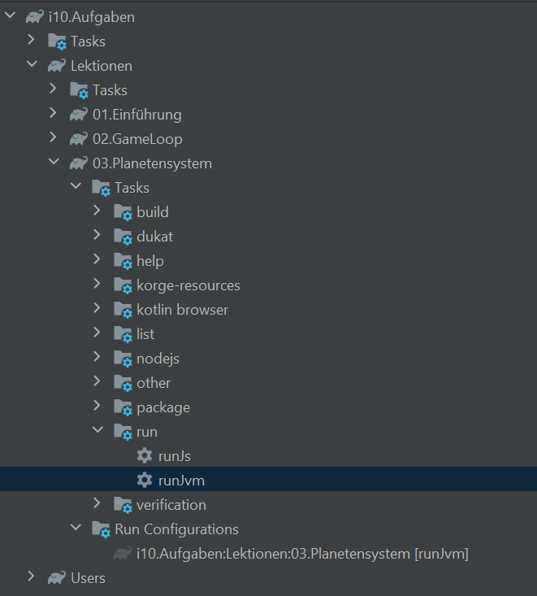
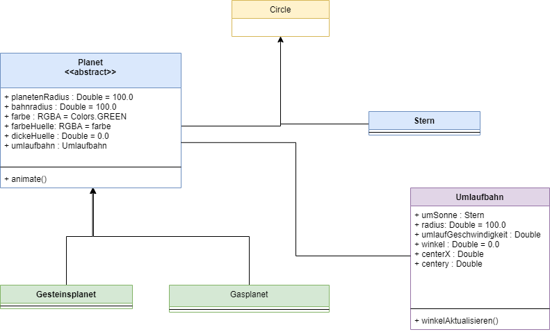
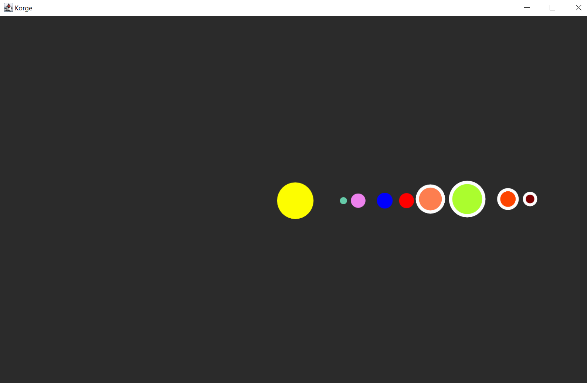

# Allgemeines
Wir wollen Planetensystem animieren, in welchem Planeten um die Sonne kreisen. Hier werden wir abstrakte Klassen kennen lernen und eine etwas kompliziertere Berechnung für die Animation.

## Allgemeiner Hinweis
Bitte achten Sie darauf, beim Ausführen jeweils den korrekten Gradle Task (`runJvm`) aus der richtigen Lektions-Untergruppe zu verwenden:


# Vorbereitungen
Erstellen Sie die Klassen `Stern`, `Planet`, `Gasplanet`, `Gesteinsplanet` und `Umlaufbahn` nach dem folgenden Klassendiagramm. Legen Sie hierzu die entsprechenden .kt Dateien im src\commonMain\kotlin Ordner an. Tragen  Sie die angegebenen Properties ein. Verwenden Sie hierzu bevorzugt die kurze Version über die Angabe der Properties im Konstruktor. 


Hinweis: Um den Datentypen `RGBA` zu verwenden und Zugriff auf `Colors` zu erhalten, müssen Sie die folgenden Zeilen an den Anfang der entsprechenden Datei setzen (entweder manuell
oder indem Sie auf `RGBA` und `Colors` klicken und `Import` (Kurztaste: ALT+Enter) wählen:
```
import com.soywiz.korim.color.Colors
import com.soywiz.korim.color.RGBA
```

# Die Klasse Stern
Ein Stern hat eine Größe, welche wir als den Radius eines Kreises interpretieren. Mit Hilfe von Vererbung, geben wir die Parameter einfach an die Klasse `Circle` weiter:

```
import com.soywiz.korge.view.Circle
import com.soywiz.korim.color.Colors

class Stern(groesse : Double = 50.0) : Circle(radius = groesse, fill = Colors.YELLOW)
```

Hinweis: Der Datentyp `RGBA` ist derjenige Datentyp, den das `Colors.` Singleton zurück gibt. Sie können hier also der Property `fill` etwa den Wert `Colors.YELLOW` zuweisen

Bearbeiten Sie die `main.kt` so, dass ihr Sonnenobjekt angezeigt und zentriert wird. Wählen Sie jetzt auch großzügige Werte für `height` und `width` des Fensters im Korge Konstruktor
```
suspend fun main() = Korge(width = 1600, height = 1000, bgcolor = Colors["#2b2b2b"]) {
    val sonne = Stern()
    sonne.x = this.width/2 - sonne.radius
    sonne.y = this.height/2 - sonne.radius
    addChild(sonne)
    }
```

Führen Sie das Projekt anschließend mit dem Gradle-Task `runJvm` aus. Achten Sie darauf, dass sie den Task auch aus der richtigen Lektion auswählen.

# Planeten, Gasplaneten und Gesteinsplaneten
Informieren Sie sich ggf. über die Unterschiede zwischen Gesteins- und Gasplaneten.
Das` <<abstract>> ` in der Klassenkarte von `Planet` bedeutet, dass es sich hierbei um eine abstrakte Klasse handelt.
Von abstrakten Klassen kann man selbst keine Objekte erzeugen ("man kann sie nicht instanziieren"). Aber wir können von ihnen erben und damit Struktur in unseren Entwurf bringen. Abstrakte Klassen können nämlich neben ganz regulären **konkreten** Funktionen auch **abstrakte** Funktionen enthalten (sobald eine Funktion in einer Klasse abstrakt ist, muss die ganze Klasse als abstrakt markiert werden).
Abstrakte Methoden haben keinen Funktionsrumpf (keine Implementierung in den geschweiften Klammern) sondern nur einen Funktionskopf. Alle Subklassen einer abstrakten Klasse **müssen** dann diese abstrakten Funktionen überschreiben und so eine konkrete Implementierung zur Verfügung stellen (siehe Code-Beispiel)
Man kann also voraussetzen, dass alle Subklassen einer abstrakten Klasse für alle in der Superklasse deklarierten abstrakten Funktionen eine Implementierung besitzen.
```
// Abstrakte Klassen werden mit abstract gekennzeichnet
abstract class Person{
// Abstrakte Properties müssen in den Subklassen initialisiert werden
abstract var alter : Int
abstract var vorname : String
abstract var nachname : String

    // Konkrete Properties werden regulär vererbt
    var schule = "asg"
    
    // Abstrakte Funktionen müssen in den Subklassen überschrieben werden
    // Sie haben keine Implementierung in der abstrakten Superklasse
    abstract fun grüßen()
    
    // Konkrete Funktionen werden regulär vererbt
    fun schuleAusgeben(){
        println("Ich gehe auf das $schule")
    }
}

class Schüler(override var alter : Int = 0,
override var vorname : String = "",
override var nachname : String = "") : Person(){

    override fun grüßen(){
        println("$vorname $nachname : Guten Morgen Herr Lehrer")
    }  
}

class Lehrer(override var alter : Int = 0,
override var vorname : String = "",
override var nachname : String = "") : Person(){

    override fun grüßen(){
        println("$vorname $nachname : Guten Morgen zusammen")
    }  
}

fun main(){
var herrMeier = Lehrer(55, "Peter", "Meier")
var linus = Schüler(15, "Linus", "Eisenbart")

    herrMeier.grüßen()
    linus.grüßen()
}
```
> Damit haben wir auch schon den Zweck von abstrakten Klassen: Man schafft eine vordefinierte Schnittstelle, der alle Subklassen gehorchen (müssen)

Im Planetenbeispiel macht das Sinn: Jeder Planet in unserem Sonnensystem ist ein `Gesteinsplanet` oder ein `Gasplanet`. Also werden von diesen Klassen Objekte erstellt. Beide Klassen erben aber von `Planet`, da es redundant wäre, wenn man gemeinsames Verhalten oder Zustände (die ja Objekte beider Subklassen auch besitzen) mehrmals deklarieren müsste.
Bei den Planeten erreichen wir durch den Einsatz der abstrakten Klasse hauptsächlich, dass wir Instanzen von `Planet` verbieten und nur Instanzen von `Gesteinsplanet`oder `Gasplanet` erlauben.

## Die Klasse Planet
Erstellen Sie die Klasse nach dem folgenden Vorbild:

```
import com.soywiz.korge.view.Circle
import com.soywiz.korim.color.Colors
import com.soywiz.korim.color.RGBA

abstract class Planet (var planetenRadius: Double = 100.0,
                       var bahnradius : Double = 100.0,
                       var farbe: RGBA = Colors.GREEN,
                       var farbeHuelle: RGBA = farbe,
                       var dickeHuelle: Double = 0.0,
                       drehtSichUm: Stern,
                       mitGeschwindigkeit: Double = 0.0) :
    Circle(radius = planetenRadius, fill = farbe, stroke = farbeHuelle, strokeThickness = dickeHuelle){

    var umlaufbahn = Umlaufbahn(drehtSichUm, bahnradius, mitGeschwindigkeit)

    init {
        // HIER MUSS CODE HIN, DER DEN PLANETEN AUTOMATISCH RECHTS NEBEN DIE SONNE SETZT      
    }

    fun animate(){
        // HIER MUSS CODE HIN, DER DIE KREISBAHN ANIMIERT (siehe weiter unten in der Anleitung)
    }
}
```
## Gasplaneten und Gesteinsplaneten
Der einzige Unterschied zwischen Gesteins- und Gasplaneten ist, dass Gasplaneten bei uns eine Hülle erhalten sollen, die wir mit einem farblich abgesetzten Rand um den Kreis
simulieren wollen. Erzeugen Sie die Klassen Gesteins- und Gasplanet so, dass Sie die Planeten nach dem folgenden Vorgaben erzeugen könnten:

### Gesteinsplanet
```
    val merkur = Gesteinsplanet(groesse = 10.0, 
        bahnradius = 120.0, 
        farbe = Colors.MEDIUMAQUAMARINE, 
        drehtSichUm = sonne, 
        mitGeschwindigkeit = 0.1 )
```

### Gasplanet
```
    val jupiter = Gasplanet(groesse = 40.0,
        bahnradius = 330.0, 
        farbe = Colors.CORAL, 
        farbeHuelle = Colors.WHITE, 
        dickeHuelle = 10.0, 
        drehtSichUm = sonne, 
        mitGeschwindigkeit = 0.07  )
```

Fügen Sie alle Planeten unseres Sonnensystems zur `Stage` hinzu und passen Sie so lange die Parameter an, bis sie korrekt angezeigt werden. Eine mögliche Abbildung sehen sie hier:



# Rotation der Planeten
Jetzt sollen die Planeten natürlich in Kreisbahnen um die Sonne rotieren. Lineare Bewegungen haben wir ja schon kennen gelernt. Hierzu musste man einfach die x- und y-Koordinaten erhöhen. Jetzt brauchen wir aber eine Möglichkeit, die x und y-Koordinaten so zu berechnen, dass sie eine Kreisbahn beschreiben. Bevor Sie sich das folgende Video ansehen, sollten Sie sich selbst kurz überlegen, ob Sie eine Idee haben, wie wir die x- und y-Koordinaten auf dieser Kreisbahn berechnen.

## Geometrie am Kreis
https://www.youtube.com/watch?v=f0mXhwt0aCY

## Ergänzen der Klassen
Jetzt wissen wir auch, wozu die Properties `winkel` und `umlaufGeschwindigkeit` aus der Klasse `Umlaufbahn` nötig sind.

Jetzt können wir die x- und y-Koordinaten endlich berechnen. Ändern Sie dazu die `animate()` Funktion in der Klasse `Planet` so ab, dass sie die folgenden Berechnen erfüllt.
1. Berechnung der x-Koordinate mit Hilfe des Cosinus (vergessen Sie nicht, den Bahnradius zu multiplizieren)
2. Berechnung der y-Koordinate mit Hilfe des Sinus  (vergessen Sie nicht, den Bahnradius zu multiplizieren)
3. Addieren Sie `umlaufbahn.centerX` und ` umlaufbahn.centerY` zu den zugehörigen Werten und weisen Sie das Ergebnis den `x` und `y` Koordinaten zu
4. Zum Ende der `animate()` Funktion muss noch der Winkel im umlaufbahn-Objekt um die Umlaufgeschwindigkeit erhöht werden (`umlaufbahn.winkelAktualisieren()`).
5. Implementieren Sie die Funktion `umlaufbahn.winkelAktualisieren()`, so dass jeden Aufruf die Winkelgeschwindigkeit auf den Winkel addiert wird.

> Kotlin liefert Funktionen für Sinus und Cosinus Berechnungen mit. Um diese zu nutzen, müssen sie `kotlin.math.*` ganz oben in ihrer `Planet.kt` Datei importieren.
```kotlin
import kotlin.math.*
```

## Fine Tuning
Stellen Sie eine moderate Umlaufgeschwindigkeit ein (denken Sie an die Einheit Radiant -> Kleine Werte unter 1 für die Geschwindigkeit vergeben)

# Aufgaben
1. Geben Sie jedem Planete eine eigene Umlaufgeschwindigkeit
2. Fügen Sie einen Hintergrund ein, der das Weltall und einzelne entfernte Sterne zeigt
3. Ersetzen Sie die geometrischen Kreisfiguren der Planeten durch Bilder
4. Um die Umlaufbahnen etwas realistischer aussehen zu lassen, können wir die Kreisbahnen in Ellipsen verwandeln. Modifizieren Sie hierzu die x- oder y-Koordinaten der Umlaufbahn (etwa durch 2 Teilen)
5. Manche Planeten können auch Monde haben. Fügen Sie Monde ein, indem Sie einer Klasse `Mond` eine `Planet`-Property geben, um den dieser kreist. Der `Mond` soll einfach eine Kreisbwegung um den (sich ständig ändernden) Mittelpunkt des Planeten machen.