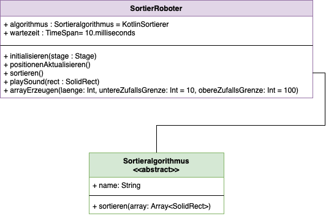
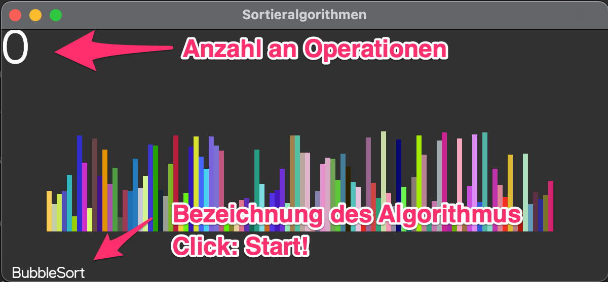

# Der Sortierroboter

Wir wollen einen Sortierroboter bauen, welcher unterschiedliche Sortieralgorithmen verwenden kann.

## Einführung
Sortieralgorithmen sind in der Informatiker-Ausbildung sehr beliebt. Wir werden in der zugehörigen Übung Arrays mit verschiedenen Sortieralgorithmen sortieren.
Darunter BubbleSort und SelectionSort. Es gibt aber noch viel [mehr solcher](https://de.wikipedia.org/wiki/Sortierverfahren) Algorithmen

## Algorithmen allgemein

Ein Algorithmus ist ein
> Verfahren mit einer endlichen Beschreibung unter Verwendung wohldefinierter Einzelanweisungen.
 
Beachten Sie, dass die Beschreibung endlich sein muss, nicht die Laufzeit/Ausführung. Ein wohldefinierter Einzelschritt ist eindeutig beschrieben und auch tatsächlich ausführbar.
Die Beschreibung muss nicht unbedingt in einer Programmiersprache festgehalten sein. Dies ist zum Beispiel auch ein Algorithmus:

```
    Handy in die Hand nehmen
    Nummer wählen
    Sprechen
    Auflegen
```

Die meisten Algorithmen sind jedoch sicherlich in Programmiersprachen festgehalten. Solche für Compiler formulierte Algorithmen nennt man Programme.
Ein Programm in Ausführung nennt man Prozess. Algorithmen können verschiedene Eigenschaften besitzen.

### Eigenschaften von Algorithmen
#### Terminiertheit
Der Algorithmus kommt nach einer endlichen Anzahl von Schritten zu einem Ende

#### Determiniertheit
Die gleiche Eingabe eines Algorithmus erzeugt auch die gleiche Ausgabe

#### Determinisimus
Zu jedem Zeitpunkt der Ausführung muss der nächste Schritt eindeutig definiert sein

## Sortieralgorithmen

Die Motivation für die Verwendung von Sortieralgorithmen in der Informatik-Ausbildung ist vielgestaltig. Ein großer Teil der weltweiten Rechenleistung fließt in das Sortieren. 
Kaum ein Medium stellt Informationen unsortiert dar. Ebenso ist das Suchen in Informationssystemen eine [ubiquitäre](https://de.wiktionary.org/wiki/ubiquitär) Operation. 
In sortierten Datensätzen lässt es sich deutlich schneller suchen. Möchte ich in einem unsortieren Array der Länge *n* wissen, ob das Element X enthalten ist, muss ich n-Mal vergleichen.
In einem sortierten Array sind weniger Vergleiche notwendig, da ich aufhören kann, weiter zu Forschen, wenn ich in der Sortierreihenfolge bei einem Wert angekommen bin, 
der den von Element X über-/unterschritten hat. Zudem ist das [EVA-Prinzip](https://de.wikipedia.org/wiki/EVA-Prinzip) hier wunderbar offenkundig.
Zu guter Letzt erkennt das menschliche Gehirn besonders schnell, ob Datensätze sortiert sind. Wir können also sehr schnell überprüfen, ob unser Sortieralgorithmus korrekte Ergebnisse liefert.

# Aufgabe



Dieses Programm besteht aus drei wichtigen Komponenten. Die Klasse `SortierRoboter` ist die zentrale Verwaltungsstelle, mit welcher wir als Programmierer sprechen.
Sie stellt eine Schnittstelle zur Verfügung, mit der wir interagieren. Die für Sie relevanten Funktionen können Sie in der Klasse `SortierRoboter`
erkennen, da sie mit einer Beschreibung versehen sind. 
Die restlichen Funktionen sind für das Bearbeiten der Aufgabe irrelevant. Wie Sie den Sortierroboter starten, sehen Sie in der `main.kt`.
Führen Sie das Programm jetzt einmal aus und machen Sie sich mit dem Vorgehen vertraut.



Voreingestellt ist der `KotlinSortierer`. Dieser verwendet einen bei Kotlin mitgelieferten Algorithmus.
Hier ist es nicht möglich, die Zwischenschritte anzeigen zu lassen, daher wird bei ihrem ersten Test die 
Rechteckreihe auf einen Schlag sortiert sein.

## Singletons
Bei allen Klassen die wie hier verwenden, handelt es sich um Singletons. Das sind Klassen, von denen
nur ein *einziges* Objekt erzeugt werden kann. Aus diesem Grund können wir ohne Konstruktorklammern beim 
Erzeugen von Singleton-Objekten arbeiten:
```
// So muss das aussehen:
SortierRoboter.algorithmus = BubbleSort

// Würden wir ohne Singletons arbeiten und ein neues BubbleSort-Objekt zuweisen wollen, würden wir
// das so schreiben:
SortierRoboter.algorithmus = BubbleSort()
```


## Sortierroboter in Aktion
Wenn wir auf den angezeigten Namen des Sortieralgorithmus klicken, schickt der Sortierroboter den Befehl
an den Sortieralgorithmus, der in der Property `SortierRoboter.algorithmus` referenziert ist. Zu welcher Klasse
dieser Sortieralgorithmus gehört, weiß der Roboter gar nicht. Er weiß nur, dass *alle* Sortieralgorithmen
eine Subklasse von der abstrakten Klasse `Sortieralgorithmus` sind und daher die Funktion `sortieren()`
besitzen müssen. Diese kann er also -egal welcher Algorithmus dahinter steckt- aufrufen. Der Empfänger
dieses Aufrufs kann also viele Gestalten (Subklassen von `Sortieralgorithmus`) haben. Dieses Programmier-
Paradigma nennt man [Polymorphie](https://de.wikipedia.org/wiki/Polymorphie_(Programmierung)). Stellen Sie
unbedingt sicher, dass Sie dieses Konzept verstanden haben.

## Handlungsanweisung
Ihre Aufgabe ist es also, Subklassen von `Sortieralgorithmus` zu erstellen und diese dem `SortierRoboter` 
in der richtigen Property (`.algorithmus`) zuzuweisen. In der Funktion `sortieren()` ihres Sortieralgoritmus
soll das Array, welches Rechteckte (`SolidRect`) enthält, nach dem Sortierverfahren des Algorithmus
sortiert werden.

Hinweis: Link zu einer Seite, welche die unterschiedlichen Sortieralgorithmen visualisiert: [Hier](https://visualgo.net/en/sorting)

1. Implementieren Sie InsertionSort wie in diesen Videos ([InsertionSort verstehen](https://youtu.be/UXae0Ixv918) ,[Sortierroboter](https://youtu.be/fVgdCvA9FdQ), [InsertionSort programmieren](https://youtu.be/yzzsLi2mDqk)) erklärt
2. Implementieren Sie SelectionSort wie in [diesem Video](https://www.youtube.com/watch?v=Q45ydkcDR8k) erklärt
3. Implementieren Sie BubbleSort wie in [diesem Video](https://www.youtube.com/watch?v=VAZNrIHZ0WE) erklärt


