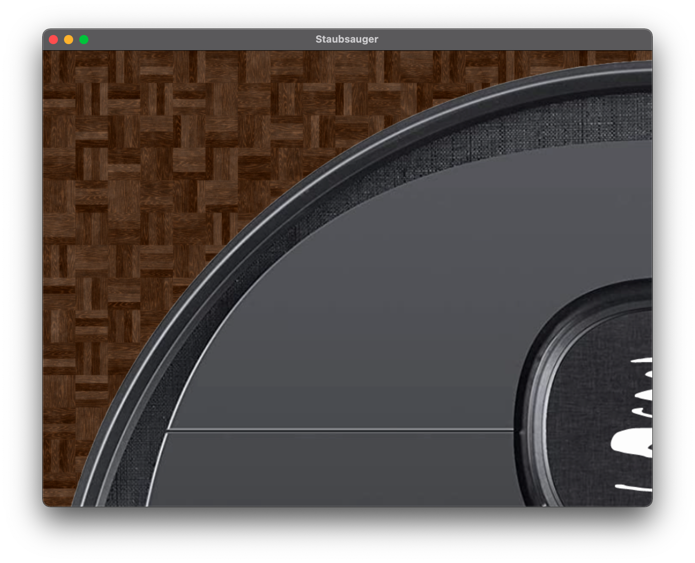
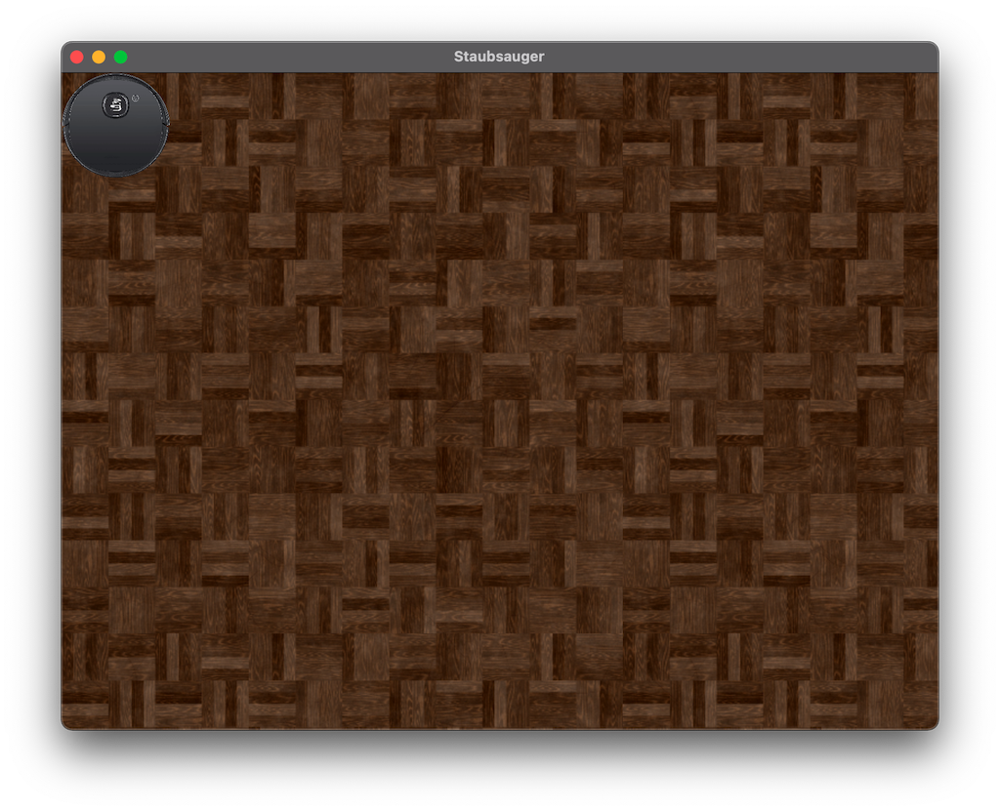

# Der Staubsaugerroboter

Wir wollen einen Sortierroboter bauen, welcher unterschiedliche Sortieralgorithmen verwenden kann.

## Vorbereitungen

### Boden legen

Im Ordner `resources/boden/` finden sich einige vorbereitete Bodentexturen als .jpg Bilddateien. Eine Textur können Sie sich wie eine
Kachel vorstellen. Eine einzelne Texturkachel ist zu klein, um in unserem Fall den ganzen Boden auszulegen.
Also müssen wir sie in x- und y-Richtung wiederholt auslegen; ganz wie Fliesenkacheln.
Hierzu gibt es eine vorgefertigte Funktion, die `bodenlegen(Bitmap)` heißt. Diese legt eine einzelne Kachel so oft auf den Boden, 
dass der Boden in XY Richtung komplett gekachelt ist. Die Bodentextur bitte auch automatisch der Stage zugefügt

1. Laden Sie ein Bitmap aus den vorgefertigten Bildern und übergeben Sie das PDF an die `bodenlegen(Bitmap)` Funktion.
LPT: Mein schnellen Wechsel zwischen den Texturen zu ermöglichen können Sie diese mit der `arrayOf` Funktion in ein `Array<Bitmap>` laden.
   Beispielcode:
   ```
    val boden = texturen[1] // texturen ist ein Array<Bitmap>
    bodenlegen(boden)
   ```

### Staubsauger hinzufügen

Im Resources Ordner findet sich auch ein Staubsauger Bild. 
2. Erstellen Sie eine Klasse `Staubsauger.kt`  und lassen Sie diese von `BaselImage` erben. Der Konstruktor der Klasse
`BaseImage` möchte ein `Bitmap` als Parameter. Deklarieren Sie ihren Konstruktor in der Klasse `Staubsauger` so,
   dass er dieses `Bitmap` entgegen nimmt und an den Konstruktor der Superklasse weiter gibt:
   
```
class Staubsauger(bitmap: Bitmap) : BaseImage(bitmap) {
}
```
Erstellen Sie anschließend ein Staubsauger-Objekt und fügen Sie ist der `Stage` zu.
Der Staubsauger wird viel zu groß sein:

Verkleinern Sie es indem, sie seine Property `scale` auf eine sinnvolle Größe ändern.
Diese Abbildung entsteht etwa bei einem Attributwert von `scale = 0.06`


### Staubsauger KI
Unser Staubsauger soll natürlich autonom arbeiten und eine Art künstliche Intelligenz besitzen, dass er etwa
seine Richtung ändert, wenn er an Hindernisse stößt. Er muss also auf verschiedene Ereignisse reagieren können.
Fügen Sie eine Funktion `entscheiden()` zur Klasse Staubsauger hinzu. Diese Funktion soll jetzt in den Gameloop
eingebaut werden. Füge also einen Updater zur Stage (`addUpdater{}`) hinzu. In diesem Updater soll die Funktion `entscheiden()` des 
Staubsaugers aufgerufen werden.

#### Fahren
Die meiste Zeit soll der Staubsauger ja einfach fahren. Wie wir so etwas erreichen, wurde bereits in den Lektionen zum
GameLoop und zum PlanetenSystem erklärt. Hier werden wir allerdings noch etwas eleganter vorgehen. Fügen Sie die veränderlichen Properties
`dx` und `dy` (beide vom Typ `Int`) dem Staubsauger hinzu.
Diese Delta-x und Delta-y Werte wollen wir auf die aktuellen Koordinaten des Staubsaugers addieren und so seine
Bewegung simulieren. Warten Sie noch kurz mit dem Festlegen von Default-Werten für ``dx`` und `dy`.
Die Delta-Werte sollen sich nämlich in dem Maße ändern, wie schnell der Roboter unterwegs ist.
Hierzu führen wir zwei weitere Properties ein. `vx` und `vy` (v für velocity).
Als Startwerte erzeugen wir für die zufällige Werte für die Geschwindigkeiten. indem wir einen Zufallsgenertor über das Interval von 0 bis 3 laufen lassen:
```
... = (0..3).random()
```
Die Default-Werte von `dx` und `dy` werden jetzt auf `vx` und `vy` gesetzt. (Warum so kompliziert? Gleich mehr dazu bei *Drehrichtung*)
Jetzt müssen die Delta-Werte jedes Frame auf die aktuelle x und y Position addiert werden. Fügen Sie hierzu eine Funktion
``fahren()`` zum Staubsauger hinzu. Addieren Sie in dieser die Werte von `dx` und `dy` auf die Properties `x` und `y` des
Staubsaugers. Legen Sie das Ergebnis der Addition in `x` und `y` ab.
Jetzt muss die Funktion ``fahren()`` noch in den Gameloop integriert werden. Da das Fahren ja eine der Entscheidungen
des Staubsaugers sein soll und die Funktion `entscheiden()` bereits im Gameloop eingeklinkt ist, können wir in dieser
Funktion (`entscheiden()`) einfach `fahren()` aufrufen.
Führe das Programm nun aus.

##### Drehrichtung
Der Roboter bewegt sich jetzt beim Starten des Programms in einem zufälligen Winkel von seiner Startposition nach rechts unten.
Allerdings sollte sich das Bild des Staubsaugers noch drehen, so dass es tatsächlich so aussieht,
dass er vorwärts fährt und nicht seitlich driftet. Dazu werden wir eine neue Property ``drehwinkel`` einfügen, welches unser Staubsaugerbild entsprechend
der Fahrtrichtung rotieren soll.