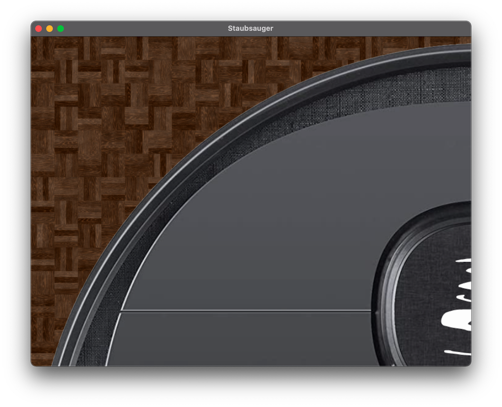

# Der Staubsaugerroboter

## Vorbereitungen

### Boden legen

Im Ordner `resources/boden/` finden sich einige vorbereitete Bodentexturen als .jpg Bilddateien. Eine Textur können Sie sich wie eine
Kachel vorstellen. Eine einzelne Texturkachel ist zu klein, um in unserem Fall den ganzen Boden auszulegen.
Also müssen wir sie in x- und y-Richtung wiederholt auslegen; ganz wie Fliesenkacheln.
Hierzu gibt es eine vorgefertigte Funktion, die `bodenlegen(Bitmap)` heißt. Diese legt eine einzelne Kachel so oft auf den Boden, 
dass der Boden in XY Richtung komplett gekachelt ist. Die Bodentextur bitte auch automatisch der Stage zugefügt

1. Laden Sie ein Bitmap aus den vorgefertigten Bildern und übergeben Sie das PDF an die `bodenlegen(Bitmap)` Funktion.
LPT: Mein schnellen Wechsel zwischen den Texturen zu ermöglichen können Sie diese mit der `arrayOf` Funktion in ein `Array<Bitmap>` laden.
   Beispielcode:
   ```
    val boden = texturen[1] // texturen ist ein Array<Bitmap>
    bodenlegen(boden)
   ```

### Staubsauger hinzufügen

Im Resources Ordner findet sich auch ein Staubsauger Bild. 
2. Erstellen Sie eine Klasse `Staubsauger.kt`  und lassen Sie diese von `BaselImage` erben. Der Konstruktor der Klasse
`BaseImage` möchte ein `Bitmap` als Parameter. Deklarieren Sie ihren Konstruktor in der Klasse `Staubsauger` so,
   dass er dieses `Bitmap` entgegen nimmt und an den Konstruktor der Superklasse weiter gibt:
   
```
class Staubsauger(bitmap: Bitmap) : BaseImage(bitmap) {
}
```
Erstellen Sie anschließend ein Staubsauger-Objekt und fügen Sie ist der `Stage` zu.
Der Staubsauger wird viel zu groß sein:

Verkleinern Sie es indem, sie seine Property `scale` auf eine sinnvolle Größe ändern.
Dies soll unbedingt im `init`-Block in der Klasse `Staubsauger` geschehen. Das Attribut `scale` setzt im Übrigen
die `scaleX` und die `scaleY` auf den angegebenen Wert.
Diese Abbildung entsteht etwa bei einem Attributwert von `scale = 0.06`

Kontrollieren Sie das Ergebnis.

### Anker senken
Derzeit verwenden die meisten Positionierungsfunktionen als Referenzpunkt den linken oberen Pixel eines `Views` (z.B. einem
`Image`). Wenn Sie also die x- und y-Positionen setzen, wird das in Relation zu diesem Pixel geschehen. Man nennt das einen Anker.
Später wollen wir den Staubsauger rotieren. Diese Rotation setzt auch am Anker an. Wir wollen aber den Staubsauger nicht um den
Standardanker rotieren, sondern um das Zentrum des Bildes.

Hierzu müssen wir den Anker auf die halbe Höhe und die halbe Breite setzen. Dies machen wir im `init`-Block mit
```
anchor(0.5, 0.5)
```
Dieser Aufruf muss unbedingt nach der Veränderung der `scale` geschehen.
Wenn Sie das Ergebnis kontrollieren sehen sie, dass der Roboter nun nur zu einem Viertel sichtbar ist.
Die x- und y-Positionierung greift jetzt an dem neuen Anker. Da wir keine x- und y-Koordinaten bisher gesetzt haben, sind diese
einfach `x=0` und `y=0`. Setzen Sie ihren Roboter nun ungefährt in die Mitte des Raumes.

### Staubsauger KI
Unser Staubsauger soll natürlich autonom arbeiten und eine Art künstliche Intelligenz besitzen, dass er etwa
seine Richtung ändert, wenn er an Hindernisse stößt. Er muss also auf verschiedene Ereignisse reagieren können.
Fügen Sie eine Funktion `aktion()` zur Klasse Staubsauger hinzu. Diese Funktion soll jetzt in den Gameloop
eingebaut werden. Füge also einen Updater zur Stage (`addUpdater{}`) hinzu. In diesem Updater soll die Funktion `aktion()` des 
Staubsaugers aufgerufen werden.

#### Fahren
Die meiste Zeit soll der Staubsauger ja einfach fahren. Wie wir so etwas erreichen, wurde bereits in den Lektionen zum
GameLoop und zum PlanetenSystem erklärt. Hier werden wir allerdings noch etwas eleganter vorgehen. 
Wir geben einfach nur einen Winkel an, in welche Richtung sich der Roboter fortbewegen soll und eine Geschwindigkeit.
Fügen Sie die Property `velocity` vom Typ `Int ein. 
Als Startwert erzeugen wir einen zufälligen Werte für die Geschwindigkeit, indem wir einen Zufallsgenertor über das Interval von 1 bis 3 laufen lassen:
```
... = (1..3).random()
```

##### Drehrichtung
Die Bewegung soll automatisch aus der Geschwindigkeit (genauer: aus der x- und y-Komponenente der Geschwindigkeit, s.o.) und dem Drehwinkel 
generiert werden. Fügen Sie eine Property `drehwinkel` ein. Unser Roboter soll in eine zufällige Richtung losfahren.
Dies kann man wieder mit einem Zufallsgenerator erreichen:
```
var drehwinkel = (0..359).random().degrees
```
In der Funktion `fahren()` können wir den Roboter nun einfach mit der Funktion `rotation()` um den Drehwinkel drehen.
Die Richtung der Drehung können Sie auf dem folgenden Bild ablesen


Testen Sie anschließend das Ergebnis

##### Bewegung
Jetzt können wir ausrechnen, um wieviele Pixel der Roboter sich in x- und y-Richtung bewegen soll:
Delta-X (also der Wert um den die x-Koordinate verändert werden soll, kurz `dx` und `dy`) ist das Produkt aus der Geschwindigkeit
und dem Cosinus des Drehwinkels (`dy` analog mit Sinus). Genau genommen muss man den Drehwinkel noch um `90.degrees` verringern, dass die Ausrichtung 
Berechnung der Koordinaten passt. Unser Roboter schaut bei 0° nämlich nach oben und nicht nach rechts.
Fügen Sie hinter der Rotationsanweisung in der `fahren()` Funktion die Berechnung für `dx` und `dy` aus.
Hinweis: Um vom `drehwinkel` (Typ `Angle`) `90.degrees` subtrahieren zu können benötigen sie einen Minus-Operator, der dies beherrscht.
Darüber hinaus sind `cos`, `sin` und `.degrees` Sonderfunktionalitäten. Diese können Sie nutzen, wenn Sie folgende Imports am Anfang
der Datei hinzufügen:
```
import com.soywiz.korma.geom.cos
import com.soywiz.korma.geom.degrees
import com.soywiz.korma.geom.minus
import com.soywiz.korma.geom.sin
```
Alternativ können Sie die Imports auch [automatisch hinzufügen lassen](https://www.jetbrains.com/help/idea/creating-and-optimizing-imports.html)

Testen Sie nun Ihr Projekt. Der Staubsauger sollte nun in die Richtung "schauen", in die er auch fährt.
Leider fährt er noch aus dem Bildschirm heraus. Dies wollen wir ändern, indem der Staubsauger nun
Kollisionen erkennt.

## Kollisionserkennung
Unser Staubsauger soll nun erkennen können, wenn er gegen ein Hindernis fährt und dann umdrehen und eine andere Richtung einschlagen.
Hierzu müssen wir erstmal Hindernisse platzieren. Da wir später auch den Kontakt mit aufzusaugendem Schmutz als Kollision handhaben wollen,
implementieren wir die Hindernisse wie folgt:


Fügen Sie die Klassen entsprechend dem Klassendiagramm hinzu. Bitte beachten Sie, dass es sich bei `Kollisionsrelevant` um ein sog. Interface (deshalb die gestrichelten Linien) handelt:
```
interface Kollidierbar {
}
```
Interfaces sind den abstrakten Klassen ähnlich, haben aber einen anderen Schwerpunkt und besitzen demnach Unterschiede.
1. Klassen implementieren ein Interface. Sie erben von abstrakten Klassen
2. Klassen können von **einer** abstrakten Klasse erben, aber mehrere Interfaces *implementieren*.
3. Vererbung: Modellierung der *is-a* Beziehung. Implementierung: Modellierung der *behaves-as* Beziehung
4. Abstrakte Klassen *können* abstrakte Properties und Funktionen enthalten. In Interfaces sind alle Properties immer abstrakt (deshalb muss man das Wort `abstract` nicht mehr davor schreiben)
5. Abstrakte Klassen haben Konstruktoren. Interfaces nicht.

Wann nehme ich nun ein Interface und wann nehme ich eine abstrakte Klasse?
Antwort: Siehe Punkte 2 und 3 

Interfaces kann man genauso einfach in Klassen implementieren, wie bei der Vererbung:

```
interface Hindernis : Kollisionsrelevant {
// Hinweis: Es stehen keine () hinter Kollisionsrelevant, da es sich um ein Interface (ohne Konstruktor) handelt.
}
```

### Wände
Wir werden nun Wände platzieren, mit denen der Staubsauger kollidieren kann. Diese Wände erben von `BaseRect` (ein Rechteck) und implementieren `Hindernis`.
Denn sie sind Rechtecke (is-a) und sollen sich verhalten wie (behaves-as) Hindernisse 
Erstellen Sie eine Klasse `Wand.kt` und bilden Sie die Vererbungs und Implementierungstruktur ab:


```
class Wand(width: Double, height: Double) : BaseRect(width, height), Hindernis {
}
```

Warum erben wir nicht von `SolidRect`, sondern von `BaseRect`? `SolidRect` ist nicht als open deklariert.
Daher können wir davon nicht erben. Zum Glück gibt es `BaseRect`, welches als `open` deklariert ist und die gleiche Funktionalität hat. (vgl. `Image` und `BaseImage`)

Platzieren Sie jetzt in der `main.kt` vier Wände welche die Bodenfläche begrenzen. Wählen Sie als Namen: `wandLinks`, `wandRechts`, `wandOben` und `wandUnten`.
Setzen Sie anschließend die x- und y-Koordinaten, sowie die Breite und Höhe der Rechtecke, so dass das Zimmer genau die Größe des angezeigten Fensters hat.
Erinnern Sie sich, dass sie die Höhe und Breite der Stage so abfragen können:
```
val breiteStage = this.width
val hoeheStage = this.height
```

### Jetzt knallt's wirklich
Nachdem wir nun die Wände platziert haben, machen wir uns an die Kollisionerkennung.
Wenn unser Staubsauter mit einem Objekt kollidiert, welches das Interface `Kollisionsrelevant`
implementiert, soll er darauf reagieren. Wir kümmern uns erstmal nur um eine Kollision
mit einem `Hindernis`. 
Wenn ein `Hindernis` berührt wird, soll der Staubsauger also nicht mehr für weiterfahren, sondern umkehren.
Wir fügen den Code hierfür dem Staubsauger-Objekt hinzu. Hierfür gibt es einen speziellen Funktionsblock, mit der Bezeichnung
`onCollision`.
Dieser kann wie nachfolgend gezeigt im `init{}` Block der Staubsauger Klasse oder direkt dem Staubsauger-Objekt in der
`main.kt` hinzugefügt werden.
Unser Roboter soll sich an einem Hindernis umdrehen, aber nicht einfach um 180° kehrt machen, sondern erst kurz zurück setzen und sich dann um
einen Zufallswinkel drehen. Fügen Sie eine neue Funktion `zurückSetzen()` zum Roboter hinzu
```
        onCollision { 
            zuruecksetzen()
        }
```
Hinweis: Alles was zwischen den geschweiften Klammern des `onCollision` Blocks geschrieben wird, wird bei jeder
Kollision ausgeführt!

In der Funktion `zuruecksetzen()` soll erst der Drehwinkel um 180° geändert werden (auf der Stelle Umkehren). Dann soll er `fahren()`
und anschließend den Drehwinkel wieder um -50° bis +50° ändern.

Hinweis: Das der `drehwinkel` vom Typ `Angle` korrekt addiert werden kann, muss ein import am Anfang der Datei eingefügt werden: 
```
import com.soywiz.korma.geom.plus
```

Führen Sie ihr Projekt aus...

#### Der Roboter spinnt
Komischerweise zappelt der Roboter nun herum wie verrückt. Unser Roboter verhält sich, als würde er ständig kollidieren.
Dies ist auch so! Denn die Kollisionen werden automatisch zwischen allen View-Objekten auf der Stage erfasst. 
Der Block `onCollision{}` wird von der Kollision des Staubsaugers mit dem Boden (ein `Image`!) ausgelöst.
Glücklicherweise haben wir hierfür bereits die Lösung: Der Staubsauger soll nur auf Kollisionen mit Objekten reagieren,
die `Kollisionsrelevant` sind. Wir filtern also die anderen Kollisionen heraus:
```
 onCollision   (filter = {
            it is Kollisionsrelevant } ) {
            zuruecksetzen()
        }
```

Der Roboter fährt jetzt fröhlich an die Wände und "prallt" dort so ab, wie er soll. 
